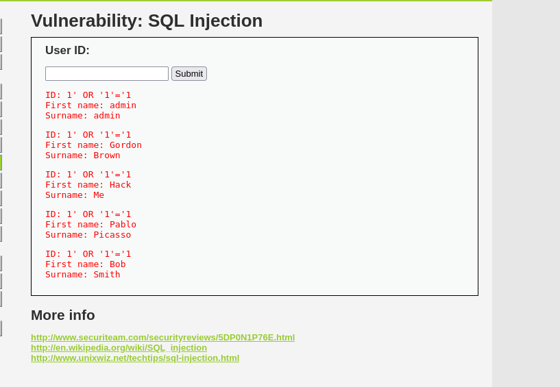

## Evidence

### Normal input

Input:

`1`

### SQL syntax error

Input:

`'`

### Security level

DVWA was configured to use the Low security level for the controlled lab exercise.

### Successful SQL Injection

Input:

`1' OR '1'='1`

The application returned multiple database records.

