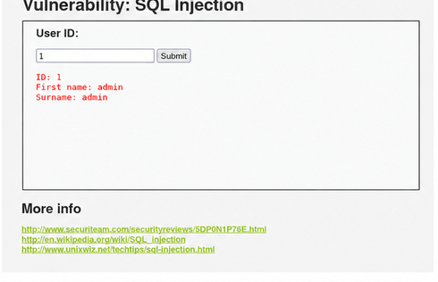
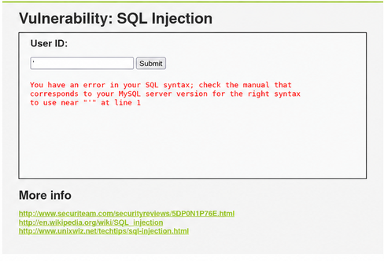
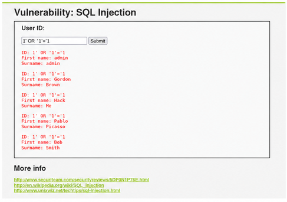

# SQL Injection

Status: Completed

### Evidence

## Normal input

Input:
`1`

The application returned a single database record.

## SQL syntax error

Input:
`'`

A malformed input caused a database syntax error.
This indicates that user input is being passed to the SQL query without proper sanitization.

## Security level

DVWA was configured to use the Low security level for the controlled lab exercise.

## Successful SQL Injection

Input:

`1' OR '1'='1`

The tautology-based input caused the application to return multiple database records.
This confirms that the User ID parameter is vulnerable to SQL injection.

## Conclusion

The User ID parameter was confirmed to be vulnerable to SQL injection.
Testing demonstrated that malformed input generated SQL errors and that a
tautology-based input could alter the query logic and return multiple records.
